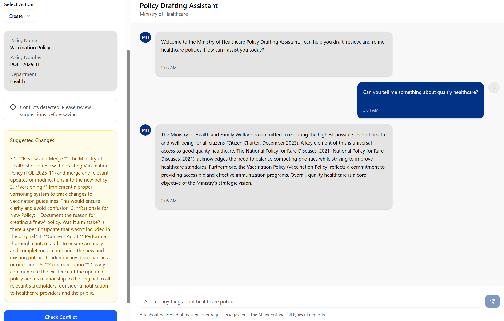

<div align="center">
  

  <h1>RAG-Enabled Policy Drafting Assistant</h1>

  <p>
    <strong>A Retrieval-Augmented Generation (RAG) agent designed to automate corporate policy drafting, semantic document search, and conflict resolution.</strong>
  </p>

  [](https://www.python.org/)
  [](https://www.langchain.com/)
  [](https://github.com/facebookresearch/faiss)
</div>

---

## Executive Summary
The Policy Drafting Agent is an intelligent system that transforms the manual, error-prone process of legal and corporate policy creation into a streamlined AI-driven workflow. By leveraging RAG architecture, the agent ensures that new drafts are grounded in existing institutional knowledge, significantly reducing the risk of "hallucinations" or non-compliant content.

The system specializes in semantic PDF search and real-time conflict detection, ensuring that every new policy draft is cross-referenced against the entire existing document library for consistency and legal alignment.

---

## Technical Architecture
The assistant utilizes a modular RAG pipeline to separate document indexing from the generation phase, allowing for high-speed retrieval across massive document sets.

* **Document Ingestion:** PDF documents are processed and indexed into high-dimensional vectors.
* **Semantic Search:** Utilizes **FAISS** (Facebook AI Similarity Search) to perform dense retrieval based on semantic meaning rather than simple keyword matching.
* **Retrieval-Augmented Generation:** Augments the user's drafting query with context retrieved from the top-k most similar existing policies.
* **Conflict Resolution Engine:** A custom LLM-based checker compares new drafts against existing k-similar policies to identify and suggest resolutions for contradictory clauses.

---

## Core Features
* **Semantic PDF Indexing:** Leverages vector embeddings to index complex legal and corporate PDF documents for lightning-fast retrieval.
* **Intelligent Conflict Checker:** Automatically identifies potential overlaps or contradictions between a new draft and current active policies.
* **Retrieval-Grounding:** Ensures drafted policies follow existing corporate language and compliance standards by providing retrieved context to the LLM.
* **Automated Suggestion Engine:** Provides specific recommendations on how to resolve identified drafting conflicts to prevent duplicate or conflicting policies.

---

## Local Development Setup

### 1. Clone the Repository
```bash
git clone [https://github.com/AnuragGaonkar/RAG-Enabled-Policy-Drafting-Assistant.git](https://github.com/AnuragGaonkar/RAG-Enabled-Policy-Drafting-Assistant.git)
cd RAG-Enabled-Policy-Drafting-Assistant
```

### 2. Environment Setup

**Install Dependencies:**
```bash
pnpm install
```
**Configure API Keys: Create a .env file in the root directory:**
```bash
MONGODB_URI=your_mongodb_url
MONGODB_DB_NAME=your_database_name

LLM_MODEL_PATH=path_to_your_model_weight_file
LLAMA_CPP_PATH=path_to_your_locally_installed_executable_model
```
**Run the Application:**
```bash
pnpm dev
```

## Engineering Challenges and Resolutions

### High-Fidelity Retrieval in Noisy Legal Text
* **Challenge**: Legal PDFs often contain complex layouts, headers, and footnotes that can dilute the relevance of vector embeddings, leading to "noisy" retrieval.
* **Resolution**: Implemented recursive character text splitting with optimized chunk overlaps (200 tokens) to preserve semantic coherence and document structure during the indexing phase

### Mitigating Policy Duplication
* **Challenge**: Manually verifying if a new policy contradicts or duplicates existing ones is labor-intensive and prone to human oversight.
* **Resolution**: Developed an LLM-based conflict checker that acts as a second-stage precision filter. It evaluates candidate drafts against the top-k retrieved documents to flag inconsistencies before any policy is finalized or saved.

---

## Visuals

### 1st Phase UI Interface



---

## Contact and Links
**Anurag Gaonkar** - [GitHub](https://github.com/AnuragGaonkar) | [LinkedIn](https://www.linkedin.com/in/anurag-gaonkar-68a463261)

Project Link: [[https://github.com/AnuragGaonkar/RAG-Enabled-Policy-Drafting-Assistant](https://github.com/AnuragGaonkar/RAG-Enabled-Policy-Drafting-Assistant)]
